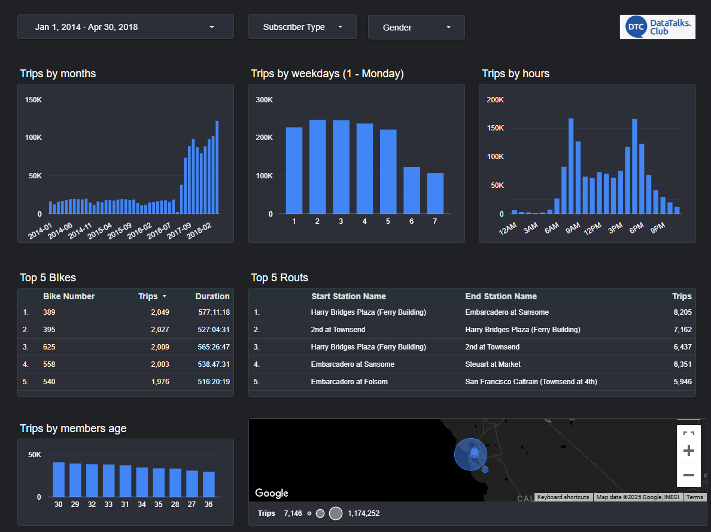
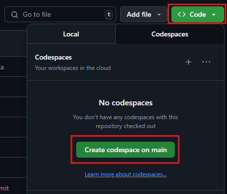
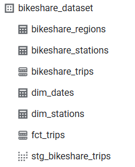

## Project Overview

This project focuses on building an end-to-end data pipeline to analyze bike rides data across various city locations. The goal is to monitor usage trends over time, understand rider behavior and trip patterns, and deliver actionable insights through a dashboard.

**Datasets Used:** [San Francisco Ford GoBike Share (Google BigQuery Public Dataset)](https://console.cloud.google.com/bigquery?ws=!1m4!1m3!3m2!1sbigquery-public-data!2ssan_francisco_bikeshare)


## Data Pipeline Architecture

**Technologies Used:**

* **IaC:** Terraform
* **Data Ingestion:** Python
* **Cloud:** Google Cloud Platform (GCP)
* **Data Lake:** Google Cloud Storage (GCS)
* **Data Warehouse:** Google BigQuery
* **Workflow Orchestration:** Kestra
* **Data Transformation:** dbt Core
* **Data Visualisation:** Looker Studio

## Dashboard
**Link:** [Looker Studio](https://lookerstudio.google.com/reporting/c96d69bb-24d7-42db-bd1e-ef383b318c3d)



## Steps to start running the Project

### Prerequisites
- GCP account with enabled billing. Add your Service Account JSON file to the _key_ folder.
- GitHub account to run this project using Codespaces. [Tutorial from ML Zoomcamp.](https://www.youtube.com/watch?v=pqQFlV3f9Bo)

### 1. Launch Codespaces



```bash
# Install Terraform
wget -O - https://apt.releases.hashicorp.com/gpg | sudo gpg --dearmor -o /usr/share/keyrings/hashicorp-archive-keyring.gpg
echo "deb [arch=$(dpkg --print-architecture) signed-by=/usr/share/keyrings/hashicorp-archive-keyring.gpg] https://apt.releases.hashicorp.com $(lsb_release -cs) main" | sudo tee /etc/apt/sources.list.d/hashicorp.list
sudo apt update && sudo apt install terraform

# Deploy infrastructure
cd terraform
terraform init
terraform apply
```
### 2. Data Download and Processing
```bash
# Install Cloud Storage client library
pip install --upgrade google-cloud-storage

# Upload files to Google CLoud Storage
cd scripts
python 01_load_data_to_gcs.py
```
### 3. Run Kestra
```bash
# Start the dashboard server
cd kestra
docker compose up
```
### 4. Run Workflows
* Access Kestra at: http://127.0.0.1:8080/
* Copy flows from _kestra/flow_ directory to Flows in Kestra UI
* Set correct Key-Values in 00_set_gcp_kv
* Set your GCP_CREDS
* Execute 01_create_tables
* Execute 02_dbt

### 5. Check data in Google BigQuery
